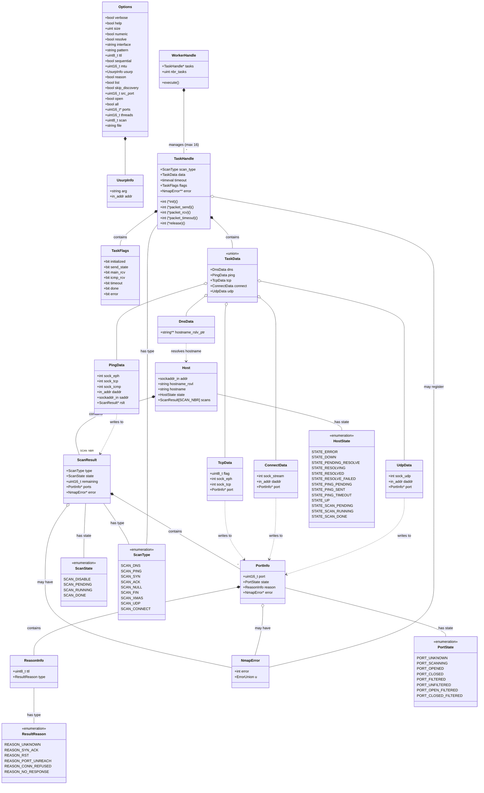
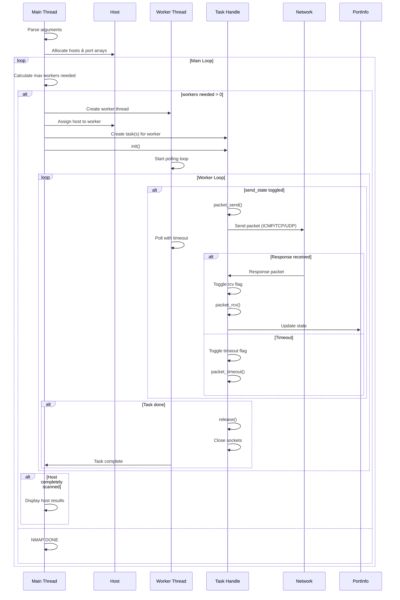
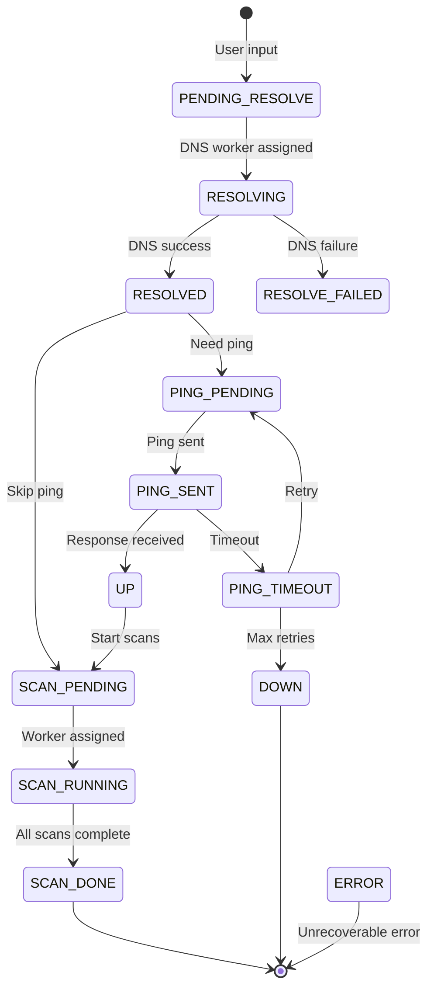
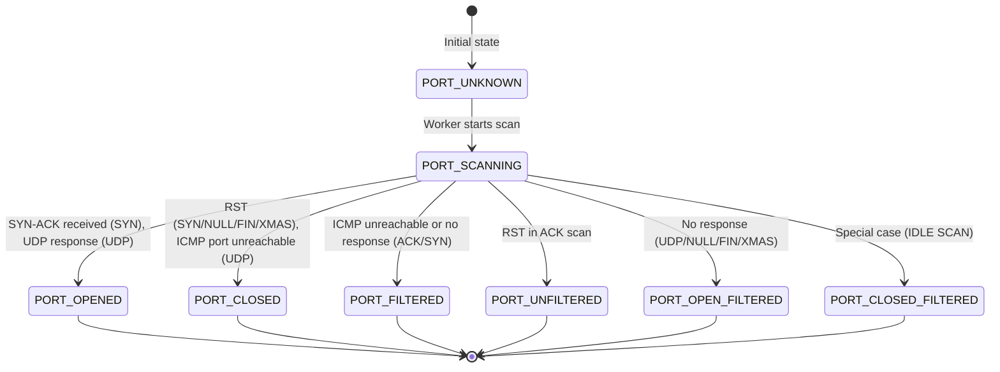
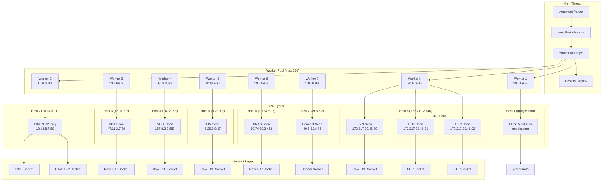

# Architecture UML - Network Mapper

## Diagramme de classes



## Diagramme de séquence - Flux principal


            
# Algorithme

1. Parsing des arguments
	- définition de la liste des hotes
	- parsing de la plage de port à scanner
2. Allocation des hôtes et des arrays de struct port_info
3. Boucle principale :
   1. Estimation du nombre de worker maximal selon la situation :
      - 1 worker/hote
      - max(nombre d'hôte restant, max_thread)
    2. Si nombre idéal de worker =  0 => NMAP DONE 
    3. Tant que le nombre max de worker n'est pas atteint :
        1.  Création d'un scan_worker :
			- Assignation d'un hôte disponible
            - Assignation des handlers
            - Appel de la fonction init 
			- Lancement du thread
			- Création du polling dans la boucle principal du thread
   2. Si un hôte est complètement scanné : on l'affiche

4. worker_switch
   1. Si flag send_tate toggled, polling avec timeout
      1. Si qlq chose a lire, on toggle flag rcv
      2. si timeout, toggle flag timeout
   2. Handlers selon l'étape : init, packet_send, packet_rcv, packet_timeout, release
      - DNS host H:
         - init : 
      - PING host H:
      	- init : raw TCP socket (binded + connected to HOST:80) with IP_RECVERR + ephemeral SOCK_STREAM socket
      	- packet_send : send ICMP echo + TCP SYN
      	- packet_rcv : rcv TCP response or ICMP error/response
      	- packet_timeout : close or resend
      	- release : close sockets
      - TCP port P :
		- init : raw TCP socket (binded + connected to HOST:P) with IP_RECVERR + ephemeral SOCK_STREAM socket
		- packet_send : send syn_ack OU syn_rst
		- packet_rcv : receive TCP answer ou ICMP error
		- packet_timeout : close conn or resend
		- release : close sockets
	 - UDP port P:
		- init : UDP socket with IP_RECVERR, binded to ephemeral port + connected (HOST:P)
		- packet_send : send probe
		- packet_rcv : receive UDP answer ou ICMP error
		- packet_timeout : close or resend
		- release : close sockets
	 - CONN port P:
		- init : TCP SOCK_STREAM socket, binded to ephemeral port.
		- packet_send : connect(), blocking
		- packet_rcv : null
		- packet_timeout : null
		- release : close socket
   3. Si qlq chose à lire : packet_rcv()
   4. Si qlq chose à envoyer : packet_send()
   5. Si timeout : packet_timeout()
   6. Si terminé : release()
   7. Si Complet
      1. fermeture des sockets
      2. arrêt du thread
**end**
        else
            Main->>Main: NMAP DONE
        end
    end
```

## Diagramme d'états - Host State Machine



## Diagramme d'états - Port State Machine



## Diagramme de composants - Architecture Threading



## Notes d'architecture

### Concepts clés

1. **Worker vs Task**
   - 1 Worker = 1 Thread = 1 boucle de polling
   - 1 Worker peut gérer jusqu'à 16 tâches simultanément
   - Seul le scan UDP peut scanner plusieurs ports d'un même hôte

2. **Gestion des états**
   - Les hôtes passent par plusieurs états (DNS → Ping → Scan)
   - Les ports ont leur propre machine d'états
   - Les tâches utilisent des flags pour la synchronisation

3. **Handlers de tâches**
   - `init()`: Initialisation (création sockets)
   - `packet_send()`: Envoi des paquets
   - `packet_rcv()`: Réception et traitement
   - `packet_timeout()`: Gestion timeout
   - `release()`: Nettoyage (fermeture sockets)

4. **Types de sockets**
   - Raw TCP: Pour SYN, ACK, NULL, FIN, XMAS scans
   - ICMP: Pour ping
   - UDP: Pour scan UDP
   - Stream: Pour scan CONNECT et lock de ports éphémères

5. **Contraintes**
   - Maximum 250 workers (threads)
   - Maximum 16 tâches par worker
   - Timeout configurable (PING_TIMEOUT = 5s)
