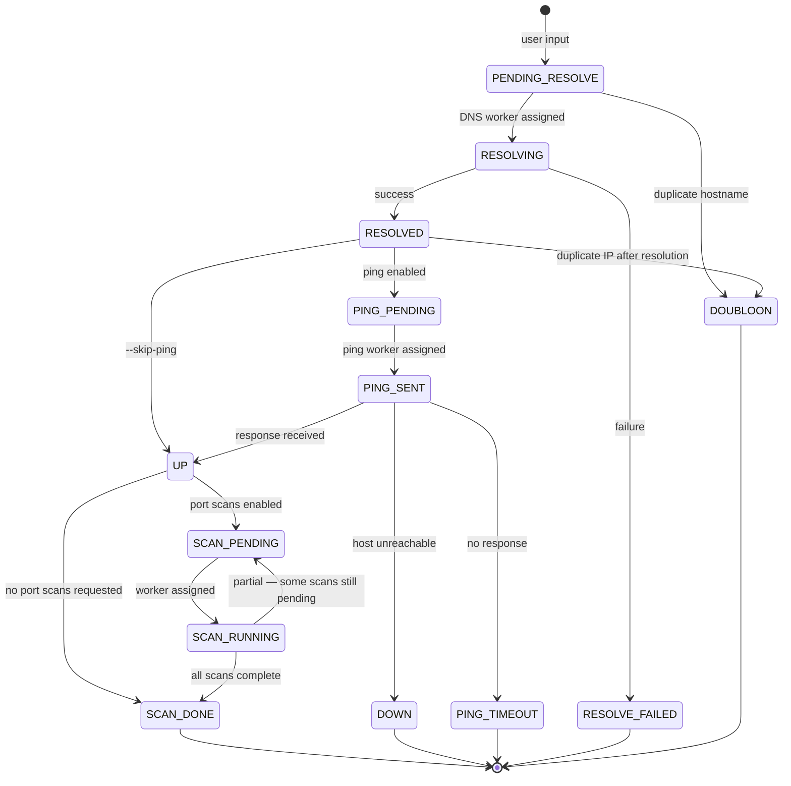
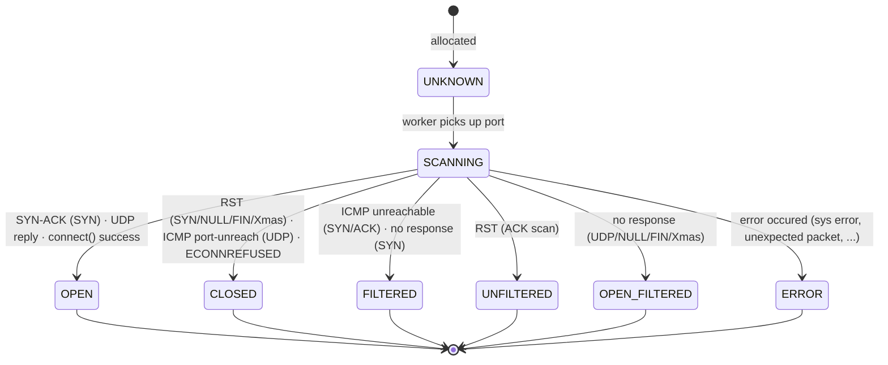
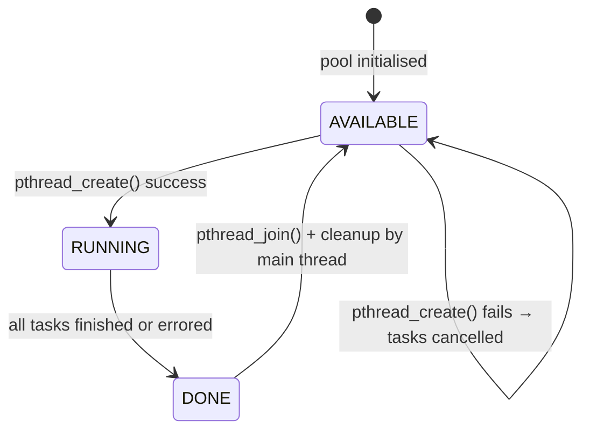
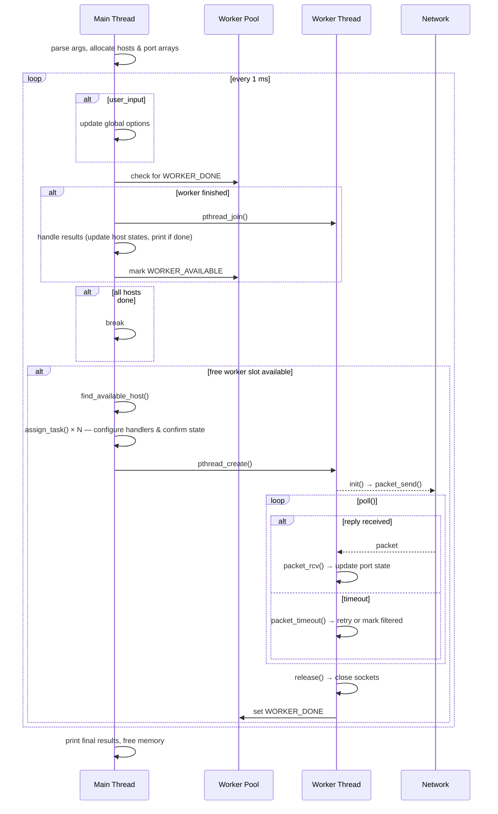
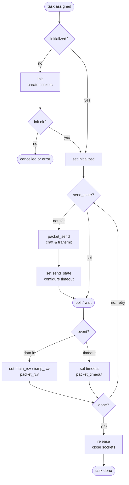
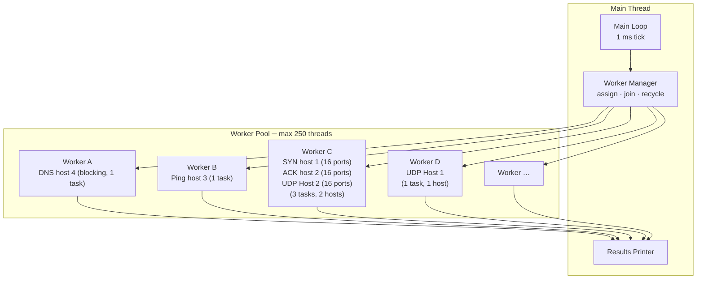

# ft_nmap — Architecture & Implementation

## Overview

`ft_nmap` is built around a **main thread / worker pool** model. The main thread drives a host state machine and dispatches work to short-lived threads; each thread executes one or more *tasks* (one task = one scan type on one host) using non-blocking I/O via `poll()`.

---

## Core Concepts

### Workers and Tasks

| Entity | Description |
|--------|-------------|
| **Scan** | May refer any available scan but also include initial ping phase (PING scan) et DNS resolution (DNS scan). |
| **Worker** | One POSIX thread, owns a `pollfd` loop. Up to 250 concurrent workers. |
| **Task** | One scan operation (e.g. SYN scan on host X). A worker carries up to 16 tasks simultaneously (adjustable via `--sim-ports` option). |
| **Blocking tasks** | DNS (`getaddrinfo`) and Connect (`connect()`) block the thread — they get a dedicated worker. |
| **Non-blocking tasks** | All other scan types multiplex on a single `poll()` call inside a worker. |

A task is defined by five function pointers set by the main thread before the worker starts:

```c
int (*init)         (struct task_handle *);   // open sockets
int (*packet_send)  (struct task_handle *);   // craft & send probe
int (*packet_rcv)   (struct task_handle *, struct pollfd); // handle reply
int (*packet_timeout)(struct task_handle *);  // handle timeout / retry
int (*release)      (struct task_handle *);   // close sockets
```

### Dynamic RTT Timeout

During the ping phase, the measured round-trip time becomes the baseline for all subsequent per-probe timeouts:

```
probe_timeout = host_rtt × rtt_factor   (default factor: 10×)
probe_timeout = min(probe_timeout, rtt_max)  (default cap: 3 000 ms)
```

If ping is skipped (`--skip-ping`), a conservative default of 500 ms is used.

---

## State Machines

### Host State Machine



Duplicate detection happens **after** DNS resolution so that `google.com` and `www.google.com` resolving to the same IP are correctly deduplicated.

### Port State Machine



### Worker State Machine



---

## Main Loop



---

## Task Lifecycle (inside a worker)



---

## Scan Type Reference

### Port state determination

| Scan | SYN-ACK | RST | ICMP unreach | No response |
|------|---------|-----|--------------|-------------|
| SYN | `open` | `closed` | `filtered` | `filtered` |
| ACK | — | `unfiltered` | `filtered` | `filtered` |
| NULL / FIN / Xmas | — | `closed` | `filtered` | `open\|filtered` |
| UDP | — | — | `closed` (port) / `filtered` (other) | `open\|filtered` |
| Connect | success → `open` | — | `filtered` | ECONNREFUSED → `closed` |

### Socket types per scan

| Scan | Main socket | Aux socket | Notes |
|------|------------|------------|-------|
| DNS | — | — | `getaddrinfo()` (blocking) |
| Ping | `RAW TCP` +  `RAW ICMP` | Ephemeral lock | `IP_RECVERR` + Bind + connect per port. Sends ICMP echo + TCP SYN simultaneously |
| SYN / ACK / NULL / FIN / Xmas | Raw TCP (`IP_RECVERR`) | Ephemeral lock | `IP_RECVERR` + Bind + Connect |
| UDP | `RAW TCP` | — | `IP_RECVERR` + Bind + Connect |
| Connect | `TCP SOCK_STREAM` | — | non  blocking socket + simultaneous `connect()` for each port |

---

## Threading Model



Key rules:
- **DNS** and **Connect** tasks always get a dedicated worker (they block the thread).
- All other scan types share a worker; one worker may carry tasks for **different hosts** as long as scan types are compatible.
- An host cannot undergo 2 simultaneous TCP task (ping, SYN, ACK, NULL, FIN, XMAS, CONNECT) or 2 simultaneous UDP scan. But an host can undergo 2 simultanous scan of different type (TCP and UDP).

---

## Key Constants

| Constant | Value | Meaning |
|----------|-------|---------|
| `MAX_WORKER` | 250 | Maximum concurrent threads. Override with `--threads` option. |
| `MAX_TASK_WORKER` | 16 | Tasks per worker |
| `MAX_PORT_NBR` | 1024 | Ports scannable per run |
| `MAX_RETRIES` | 3 | Number of time a task is retried when cancelled |
| `PING_TIMEOUT` | 3 s | Ping phase hard timeout |
| `DFT_HOST_RTT` | 500 ms | RTT fallback when ping is skipped |
| `DFT_PORT_TIMEOUT_FACTOR` | 10× | Multiplier: RTT → probe timeout. Overridable with `--rtt-factor` option. |
| `DFT_MAX_RTT` | 3 000 ms | Maximum probe timeout cap. Overridable with `--rtt-max` option |

---

## Synchronisation

Two fields require atomic access because both the main thread and workers read/write them concurrently:

- `port_info.state` — written by worker, read by main thread after join (but declared `_Atomic` for correctness across retry paths)
- `worker_handle.state` — written by worker (`WORKER_DONE`), polled by main thread

All other host/scan data is accessed exclusively by the main thread while no worker holds a reference to it.