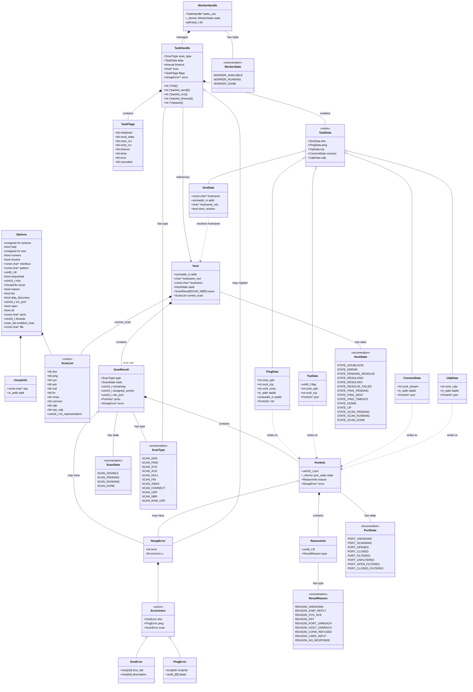
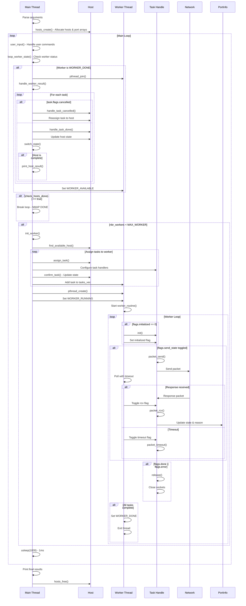
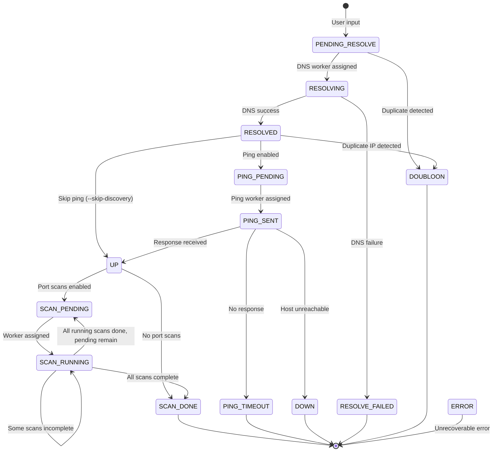
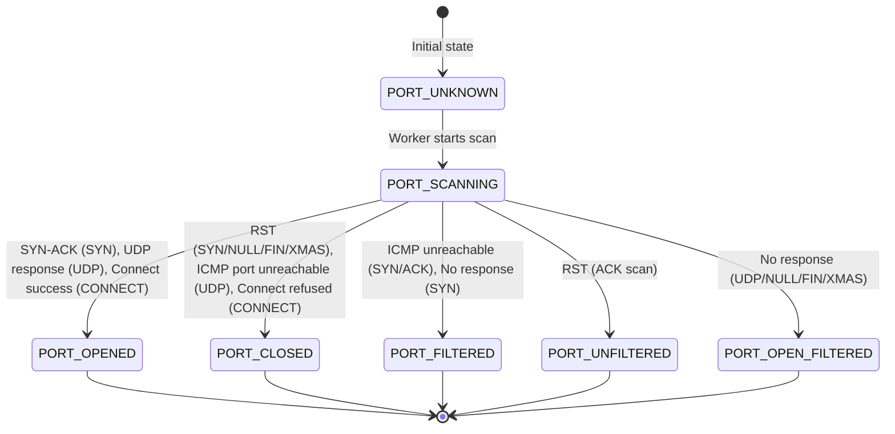
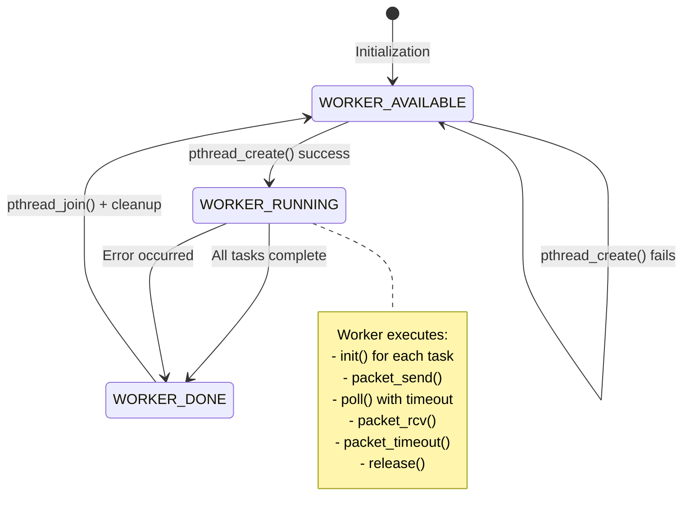

# Architecture UML - Network Mapper

## Diagramme de classes



## Diagramme de séquence - Flux principal



## Diagramme d'états - Host State Machine



## Diagramme d'états - Port State Machine



## Diagramme de composants - Architecture Threading

```mermaid
graph TB
    subgraph "Main Thread"
        Parser[Argument Parser]
        Allocator[hosts_create<br/>Port Allocator]
        WorkerManager[Worker Manager<br/>init_worker/loop_worker_state]
        Display[Results Display<br/>print_host_result]
        UserInput[User Input Handler<br/>user_input]
    end
    
    subgraph "Worker Pool (max 250)"
        W1[Worker 1<br/>WORKER_RUNNING<br/>DNS task]
        W2[Worker 2<br/>WORKER_RUNNING<br/>PING task]
        W3[Worker 3<br/>WORKER_RUNNING<br/>SYN task]
        W4[Worker 4<br/>WORKER_RUNNING<br/>ACK task]
        W5[Worker 5<br/>WORKER_RUNNING<br/>NULL task]
        W6[Worker 6<br/>WORKER_RUNNING<br/>FIN task]
        W7[Worker 7<br/>WORKER_RUNNING<br/>XMAS task]
        W8[Worker N<br/>WORKER_DONE<br/>Multiple UDP tasks]
    end
    
    subgraph "Task Types"
        subgraph "Host 1 (google.com)"
            DNS[DNS Resolution<br/>SCAN_DNS<br/>Blocking]
        end
        subgraph "Host 2 (10.14.8.7)"
            PING[ICMP/TCP Ping<br/>SCAN_PING<br/>10.14.8.7:80]
        end
        subgraph "Host 3 (47.11.2.7)"
            SYN[SYN Scan<br/>SCAN_SYN<br/>47.11.2.7:80]
        end
        subgraph "Host 4 (167.8.2.9)"
            ACK[ACK Scan<br/>SCAN_ACK<br/>167.8.2.9:443]
        end
        subgraph "Host 5 (8.29.3.9)"
            NULL[NULL Scan<br/>SCAN_NULL<br/>8.29.3.9:21]
        end
        subgraph "Host 6 (10.74.89.2)"
            FIN[FIN Scan<br/>SCAN_FIN<br/>10.74.89.2:22]
        end
        subgraph "Host 7 (49.6.5.2)"
            XMAS[XMAS Scan<br/>SCAN_XMAS<br/>49.6.5.2:23]
        end
        subgraph "Host 8 (172.217.20.46)"
            CONNECT[Connect Scan<br/>SCAN_CONNECT<br/>172.217.20.46:25<br/>Blocking]
        end
        subgraph H9["Host 9 (8.8.8.8)"]
            subgraph "UDP Scan (Multi-port)"
                UDP1[UDP<br/>SCAN_UDP<br/>8.8.8.8:53]
                UDP2[UDP<br/>SCAN_UDP<br/>8.8.8.8:123]
                UDP3[UDP<br/>SCAN_UDP<br/>8.8.8.8:161]
            end
        end
    end
    
    subgraph "Network Layer"
        DNS_SYS[getaddrinfo<br/>Blocking]
        PING_ICMP[ICMP Socket<br/>SOCK_RAW]
        PING_TCP[Raw TCP Socket<br/>IP_RECVERR]
        SYN_TCP[Raw TCP Socket<br/>IP_RECVERR]
        ACK_TCP[Raw TCP Socket<br/>IP_RECVERR]
        NULL_TCP[Raw TCP Socket<br/>IP_RECVERR]
        FIN_TCP[Raw TCP Socket<br/>IP_RECVERR]
        XMAS_TCP[Raw TCP Socket<br/>IP_RECVERR]
        CONNECT_STREAM[Stream Socket<br/>SOCK_STREAM<br/>Blocking connect]
        UDP_SOCKS[UDP Sockets<br/>IP_RECVERR<br/>Connected]
    end
    
    Parser --> Allocator
    Allocator --> WorkerManager
    UserInput --> WorkerManager
    WorkerManager --> W1
    WorkerManager --> W2
    WorkerManager --> W3
    WorkerManager --> W4
    WorkerManager --> W5
    WorkerManager --> W6
    WorkerManager --> W7
    WorkerManager --> W8
    
    W1 --> DNS
    W2 --> PING
    W3 --> SYN
    W4 --> ACK
    W5 --> NULL
    W6 --> FIN
    W7 --> XMAS
    W8 --> CONNECT
    W8 --> UDP1
    W8 --> UDP2
    W8 --> UDP3
    
    DNS --> DNS_SYS
    PING --> PING_ICMP
    PING --> PING_TCP
    SYN --> SYN_TCP
    ACK --> ACK_TCP
    NULL --> NULL_TCP
    FIN --> FIN_TCP
    XMAS --> XMAS_TCP
    CONNECT --> CONNECT_STREAM
    UDP1 --> UDP_SOCKS
    UDP2 --> UDP_SOCKS
    UDP3 --> UDP_SOCKS
    
    WorkerManager --> Display
```



## Diagramme d'états - Worker State Machine



---

## Notes d'architecture

### Concepts clés

#### 1. Worker vs Task
- **1 Worker = 1 Thread = 1 boucle de polling**
- Un worker peut gérer **jusqu'à MAX_TASK_WORKER (16) tâches** simultanément
- **Seul le scan UDP** peut scanner plusieurs ports d'un même hôte dans un seul worker
- Les scans bloquants (DNS, CONNECT) sont exécutés par des workers dédiés

#### 2. Gestion des états des hôtes

La machine d'états des hôtes est gérée par la fonction `switch_state()` qui effectue des transitions automatiques :

**États initiaux :**
- `STATE_PENDING_RESOLVE` : En attente d'assignation DNS
- `STATE_DOUBLOON` : Hôte dupliqué détecté (terminal)

**Résolution DNS :**
- `STATE_RESOLVING` → `STATE_RESOLVED` (succès)
- `STATE_RESOLVING` → `STATE_RESOLVE_FAILED` (échec, terminal)

**Phase de ping :**
- `STATE_RESOLVED` → `STATE_PING_PENDING` si ping activé
- `STATE_RESOLVED` → `STATE_UP` si `--skip-discovery`
- `STATE_PING_PENDING` → `STATE_PING_SENT` (worker assigné)
- `STATE_PING_SENT` → `STATE_UP` / `STATE_DOWN` / `STATE_PING_TIMEOUT`

**Phase de scan :**
- `STATE_UP` → `STATE_SCAN_PENDING` si scans activés
- `STATE_SCAN_PENDING` → `STATE_SCAN_RUNNING` (worker assigné)
- `STATE_SCAN_RUNNING` → `STATE_SCAN_DONE` (tous les scans terminés)

**Le champ `current_scan`** (union scan_list) trace les scans en cours d'exécution bit par bit.

#### 3. Gestion des tâches et workers

**Assignation de tâches (`assign_task()`) :**
1. Trouve un hôte disponible avec `find_available_host()`
2. Configure la tâche selon le type de scan
3. Assigne les handlers (init, send, rcv, timeout, release)
4. Appelle `confirm_task()` pour mettre à jour l'état de l'hôte
5. Ajoute la tâche au vecteur du worker

**Types de tâches :**
- **Bloquantes** : `SCAN_DNS` (getaddrinfo), `SCAN_CONNECT` (connect bloquant)
  - Exécutées par des workers dédiés (1 tâche/worker)
- **Non-bloquantes** : Tous les autres scans
  - Peuvent être combinés (jusqu'à 16 tâches/worker)

**Paramètre `skip_blocking` :**
- `true` : Rejette les scans DNS et CONNECT (pour workers multi-tâches)
- `false` : Accepte tous types de scans (pour workers dédiés)

#### 4. Cycle de vie d'une tâche

**Flags de tâche (`task_handle.flags`) :**
```c
struct {
    uint8_t initialized : 1;  // init() appelé
    uint8_t send_state : 1;   // Paquet envoyé, en attente de réponse
    uint8_t main_rcv : 1;     // Réponse TCP/UDP reçue
    uint8_t icmp_rcv : 1;     // Réponse ICMP reçue (ping uniquement)
    uint8_t timeout : 1;      // Timeout atteint
    uint8_t done : 1;         // Tâche terminée avec succès
    uint8_t error : 1;        // Erreur fatale (ne sera pas réassignée)
    uint8_t cancelled : 1;    // Échec au lancement (sera réassignée)
}
```

**Déroulement dans worker_routine() :**
1. `!initialized` → appelle `init()`, crée les sockets
2. `send_state` toggle → appelle `packet_send()`, envoie le paquet
3. `poll()` avec timeout configuré dans `task.timeout`
4. Si données reçues → toggle `main_rcv` ou `icmp_rcv` → appelle `packet_rcv()`
5. Si timeout → toggle `timeout` → appelle `packet_timeout()`
6. `done` ou `error` → appelle `release()`, ferme les sockets
7. Worker passe à `WORKER_DONE`

**Gestion dans le thread principal :**
- `handle_task_done()` : Met à jour `host.state`, appelle `switch_state()`
- `handle_task_cancelled()` : Remet la tâche en `SCAN_PENDING`, décrémente `assigned_worker`

#### 5. Handlers de tâches

Chaque type de scan définit ses propres handlers :

**DNS (SCAN_DNS) :**
- `init()` : `dns_init()` - Prépare la résolution
- `packet_send()` : NULL (bloquant, pas de polling)
- `packet_rcv()` : NULL
- `packet_timeout()` : NULL
- `release()` : NULL

**PING (SCAN_PING) :**
- `init()` : `ping_init()` - Crée sockets ICMP, TCP raw, ephemeral
- `packet_send()` : `ping_packet_send()` - Envoie ICMP echo + TCP SYN
- `packet_rcv()` : `ping_packet_rcv()` - Traite réponse TCP ou ICMP
- `packet_timeout()` : `ping_packet_timeout()` - Gère timeout/retry
- `release()` : `ping_release()` - Ferme sockets

**TCP Scans (SYN/ACK/NULL/FIN/XMAS) :**
- `init()` : Crée raw TCP socket + ephemeral lock socket
- `packet_send()` : Envoie paquet TCP avec flags spécifiques
- `packet_rcv()` : Analyse réponse TCP ou ICMP error
- `packet_timeout()` : Retry ou marque comme filtered
- `release()` : Ferme sockets

**UDP Scan (SCAN_UDP / SCAN_RAW_UDP) :**
- `init()` : Crée UDP socket avec IP_RECVERR, bind + connect
- `packet_send()` : Envoie probe UDP
- `packet_rcv()` : Reçoit réponse UDP ou ICMP port unreachable
- `packet_timeout()` : Marque comme open|filtered
- `release()` : Ferme socket

**CONNECT Scan (SCAN_CONNECT) :**
- `init()` : Crée SOCK_STREAM socket, bind
- `packet_send()` : Appelle `connect()` (bloquant)
- `packet_rcv()` : NULL
- `packet_timeout()` : NULL
- `release()` : Ferme socket

#### 6. Types de sockets

| Type de scan | Socket principal | Socket auxiliaire | Options |
|--------------|------------------|-------------------|---------|
| DNS | - | - | Utilise `getaddrinfo()` |
| PING | SOCK_RAW (ICMP) | Raw TCP + ephemeral | IP_RECVERR |
| SYN/ACK/NULL/FIN/XMAS | Raw TCP | Ephemeral lock | IP_RECVERR, bind + connect |
| UDP | SOCK_DGRAM | - | IP_RECVERR, bind + connect |
| RAW_UDP | SOCK_RAW (UDP) | - | IP_HDRINCL (si usurp activé) |
| CONNECT | SOCK_STREAM | - | Bind, connect bloquant |

**Ephemeral lock socket :**
- Socket `SOCK_STREAM` bind à un port éphémère
- Empêche le kernel d'envoyer des RST automatiques
- Utilisé pour PING et scans TCP raw

#### 7. Contraintes et limites

- **MAX_WORKER = 250** : Maximum de threads simultanés
- **MAX_TASK_WORKER = 16** : Maximum de tâches par worker
- **MAX_PORT_NBR = 1024** : Maximum de ports différents scannables
- **PING_TIMEOUT = 5s** : Timeout par défaut pour ping

#### 8. Synchronisation et atomicité

**Accès atomiques requis :**
- `port_info.state` : `_Atomic enum port_state`
- `worker_handle.state` : `_Atomic enum worker_state`

**Raison :**
- Le thread principal lit `worker.state` pour détecter `WORKER_DONE`
- Les workers modifient `port.state` pendant que le main thread peut les lire
- Évite les race conditions

#### 9. Gestion des erreurs

**Structure `nmap_error` :**
```c
struct nmap_error {
    int error;  // errno number
    union {
        struct {
            char func_fail[16];
            char description[64];
        } dns;
        struct {
            icmphdr icmphdr;
            uint8_t detail[8];
        } ping;
        struct { } scan;
    } u;
};
```

**Pointeur `task.error` :**
- Pointe vers `scan_result.error` ou `port_info.error`
- Permet au worker d'enregistrer les erreurs directement
- Le main thread libère la mémoire après traitement

#### 10. Flux de données principal

**Boucle principale (`main_loop()`) :**
```c
while (1) {
    user_input();                          // Gère commandes utilisateur
    usleep(1000);                          // Sleep 1ms
    loop_worker_state();                   // Vérifie workers terminés
    if (check_hosts_done()) break;         // Tous les hôtes traités ?
    if (nbr_workers < MAX_WORKER)
        init_worker();                     // Lance nouveau worker si besoin
}
```

**Gestion des résultats (`loop_worker_state()`) :**
1. Parcourt `workers_pool[MAX_WORKER]`
2. Si `state == WORKER_DONE` : appelle `pthread_join()`
3. Appelle `handle_worker_result()` :
   - Pour chaque tâche du worker :
     - Si `cancelled` → `handle_task_cancelled()` (réassignation)
     - Sinon → `handle_task_done()` (mise à jour état)
4. Libère `tasks_vec`, remet worker à `WORKER_AVAILABLE`

#### 11. Détection des doublons

**Fonction `check_double_host()` :**
- Appelée après résolution DNS réussie
- Compare `host->addr` avec tous les autres hôtes du vecteur
- Si IP identique trouvée → marque l'hôte comme `STATE_DOUBLOON`

**Pourquoi après DNS ?**
- `google.com` et `www.google.com` peuvent résoudre vers la même IP
- La vérification doit se faire sur l'adresse IP résolue, pas le nom

#### 12. Verbosité et debug

**Niveaux de verbosité (`opts->verbose`) :**
- `>= 1` : Affiche début/fin de scan, résultats finaux
- `>= 2` : Affiche résultats de chaque tâche (même sans erreur)
- `>= 3` : Affiche création/arrêt des workers avec `print_worker()`

**Fonctions de debug :**
- `print_task()` : Affiche configuration d'une tâche
- `print_task_result()` : Affiche résultat d'une tâche
- `print_scan_result()` : Affiche résultat d'un scan complet
- `print_host_result()` : Affiche résultat final d'un hôte
- `print_worker()` : Affiche état d'un worker et ses tâches

#### 13. Scan UDP multi-ports

**Particularité :**
- Un seul worker peut gérer plusieurs ports UDP du même hôte
- Jusqu'à MAX_TASK_WORKER (16) ports simultanément
- Chaque port a son propre socket UDP
- `scan_result.remaining` : compte de ports à assigner
- Workers décrément atomiquement `remaining` pour choisir leur port

**Pourquoi cette limitation pour UDP uniquement ?**
- Les scans TCP utilisent des sockets raw nécessitant un bind par port
- UDP peut utiliser plusieurs sockets connectés depuis un seul thread
- Optimisation pour les scans UDP qui sont naturellement plus lents

#### 14. Raisons de résultats (`reason_info`)

**Champ `port_info.reason` :**
```c
struct {
    uint8_t ttl;            // TTL de la réponse reçue
    enum result_reason type; // Type de raison
}
```

**Types de raisons (`result_reason`) :**
- `REASON_UNKNOWN` : État initial
- `REASON_ICMP_REPLY` : Réponse ICMP echo reçue (ping)
- `REASON_SYN_ACK` : SYN-ACK reçu (port ouvert)
- `REASON_RST` : RST reçu (port fermé)
- `REASON_PORT_UNREACH` : ICMP port unreachable (UDP)
- `REASON_HOST_UNREACH` : ICMP host unreachable
- `REASON_CONN_REFUSED` : Connect refusé
- `REASON_USER_INPUT` : Fourni par l'utilisateur
- `REASON_NO_RESPONSE` : Timeout sans réponse

**Option `--reason` :**
- Si activée, affiche le TTL et le type de raison pour chaque port
- Utile pour debug et analyse de la topologie réseau

---

## Algorithme détaillé

### 1. Phase d'initialisation

```
ft_nmap(args, nbr_args, opts)
│
├─> hosts_create(args, nbr_args, opts)
│   ├─> Parse host list from args
│   ├─> Allocate host vector
│   ├─> For each host:
│   │   ├─> Set state = STATE_PENDING_RESOLVE
│   │   ├─> Initialize scan_result array
│   │   ├─> Allocate port arrays based on opts->ports
│   │   └─> Set scan states (DISABLE/PENDING) based on opts->enabled_scan
│   └─> Return host vector
│
└─> main_loop(vec_hosts, opts)
```

### 2. Boucle principale

```
main_loop(vec_hosts, opts)
│
└─> while (true)
    │
    ├─> user_input(vec_hosts, workers_pool, opts)
    │   └─> Handle interactive commands (if implemented)
    │
    ├─> usleep(1000)  // 1ms sleep
    │
    ├─> loop_worker_state(workers_pool, &nbr_workers, vec_hosts, opts)
    │   │
    │   └─> For i = 0 to MAX_WORKER
    │       │
    │       └─> If workers_pool[i].state == WORKER_DONE
    │           ├─> pthread_join(workers_pool[i].tid, &ret)
    │           ├─> handle_worker_result(&workers_pool[i], ret, vec_hosts, opts)
    │           │   │
    │           │   └─> For each task in workers_pool[i].tasks_vec
    │           │       │
    │           │       ├─> If task.flags.cancelled
    │           │       │   └─> handle_task_cancelled(task)
    │           │       │       ├─> Decrement scan.assigned_worker
    │           │       │       ├─> Set scan.state = SCAN_PENDING
    │           │       │       ├─> Reset host.state appropriately
    │           │       │       └─> Free task.error if allocated
    │           │       │
    │           │       └─> Else
    │           │           └─> handle_task_done(task, vec_hosts, opts)
    │           │               ├─> Decrement scan.assigned_worker
    │           │               ├─> Reset current_scan bit
    │           │               ├─> Update host based on task result:
    │           │               │   ├─> DNS: Set addr, hostname_rsvl, check doubloon
    │           │               │   └─> PING: Set UP/DOWN/TIMEOUT
    │           │               ├─> Set scan.state = SCAN_DONE
    │           │               ├─> Call switch_state(host)
    │           │               ├─> If verbose: print task/scan results
    │           │               └─> If host complete: print_host_result()
    │           │
    │           ├─> Free workers_pool[i].tasks_vec
    │           ├─> Set workers_pool[i].state = WORKER_AVAILABLE
    │           └─> nbr_workers--
    │
    ├─> If check_hosts_done(vec_hosts)
    │   └─> break  // Exit main loop
    │
    └─> If nbr_workers < MAX_WORKER
        │
        └─> init_worker(vec_hosts, workers_pool, opts)
            ├─> Find available worker in pool
            ├─> Allocate tasks_vec (max MAX_TASK_WORKER)
            │
            ├─> Loop to assign tasks:
            │   ├─> host = find_available_host(vec_hosts, skip_blocking)
            │   │   └─> Return first host with:
            │   │       ├─> STATE_PENDING_RESOLVE (if !skip_blocking)
            │   │       └─> STATE_PING_PENDING
            │   │
            │   ├─> If no host found: break
            │   │
            │   ├─> assign_task(host, &task, skip_blocking, opts)
            │   │   │
            │   │   ├─> Switch host.state:
            │   │   │   │
            │   │   │   ├─> STATE_PENDING_RESOLVE:
            │   │   │   │   ├─> task.scan_type = SCAN_DNS
            │   │   │   │   ├─> task.init = dns_init
            │   │   │   │   ├─> task.packet_send/rcv/timeout/release = NULL
            │   │   │   │   └─> Configure dns_data
            │   │   │   │
            │   │   │   └─> STATE_PING_PENDING:
            │   │   │       ├─> task.scan_type = SCAN_PING
            │   │   │       ├─> task.init = ping_init
            │   │   │       ├─> task.packet_send = ping_packet_send
            │   │   │       ├─> task.packet_rcv = ping_packet_rcv
            │   │   │       ├─> task.packet_timeout = ping_packet_timeout
            │   │   │       ├─> task.release = ping_release
            │   │   │       ├─> task.timeout = {5s, 0}
            │   │   │       └─> Configure ping_data
            │   │   │
            │   │   ├─> If skip_blocking && (DNS || CONNECT): return false
            │   │   ├─> confirm_task(&task)
            │   │   │   └─> Update host state and current_scan bits
            │   │   └─> return true
            │   │
            │   ├─> If assign_task failed && task is blocking:
            │   │   └─> break (blocking tasks need dedicated worker)
            │   │
            │   ├─> Add task to tasks_vec
            │   │
            │   └─> Continue while (tasks < MAX_TASK_WORKER)
            │
            ├─> Resize tasks_vec to actual size
            ├─> Set worker.state = WORKER_RUNNING
            │
            └─> pthread_create(&worker.tid, NULL, worker_routine, worker)
                ├─> If success: nbr_workers++
                └─> If fail: cancel_worker() and return NULL
```

### 3. Routine du worker

```
worker_routine(void *data)
│
├─> worker = (struct worker_handle *)data
│
└─> Loop until all tasks done
    │
    ├─> For each task in worker->tasks_vec:
    │   │
    │   ├─> If !flags.initialized:
    │   │   ├─> Call task.init()
    │   │   │   ├─> DNS: Prepare getaddrinfo call
    │   │   │   ├─> PING: Create ICMP + raw TCP + ephemeral sockets
    │   │   │   ├─> TCP: Create raw TCP + ephemeral sockets, bind + connect
    │   │   │   ├─> UDP: Create UDP socket, IP_RECVERR, bind + connect
    │   │   │   └─> CONNECT: Create stream socket, bind
    │   │   │
    │   │   ├─> If init failed:
    │   │   │   ├─> Set flags.error or flags.cancelled
    │   │   │   └─> Skip to next task
    │   │   │
    │   │   └─> Set flags.initialized = 1
    │   │
    │   ├─> If flags.send_state not set:
    │   │   ├─> Call task.packet_send()
    │   │   │   ├─> DNS: Call getaddrinfo (blocking)
    │   │   │   ├─> PING: Send ICMP echo + TCP SYN to port 80
    │   │   │   ├─> TCP: Send TCP packet with appropriate flags
    │   │   │   ├─> UDP: Send UDP probe
    │   │   │   └─> CONNECT: Call connect() (blocking)
    │   │   │
    │   │   ├─> If send failed:
    │   │   │   ├─> Set flags.error
    │   │   │   └─> Continue
    │   │   │
    │   │   └─> Set flags.send_state = 1
    │   │
    │   └─> Add socket FDs to pollfd array (if non-blocking)
    │
    ├─> poll(pollfds, nfds, timeout_ms)
    │   ├─> timeout_ms = minimum of all task.timeout values
    │   └─> Monitor all task sockets for POLLIN
    │
    ├─> For each task with received data (POLLIN):
    │   ├─> Set flags.main_rcv or flags.icmp_rcv
    │   │
    │   └─> Call task.packet_rcv()
    │       ├─> DNS: Copy resolved addr and hostname
    │       ├─> PING: Parse TCP/ICMP response, set port state
    │       ├─> TCP: Parse TCP/ICMP response, determine port state
    │       ├─> UDP: Parse UDP/ICMP response, determine port state
    │       └─> CONNECT: Check connect() result
    │
    ├─> For each task with timeout:
    │   ├─> Set flags.timeout = 1
    │   │
    │   └─> Call task.packet_timeout()
    │       ├─> DNS: Should not timeout (blocking)
    │       ├─> PING: Retry or set DOWN/TIMEOUT
    │       ├─> TCP: Retry or set FILTERED
    │       ├─> UDP: Set OPEN_FILTERED
    │       └─> CONNECT: Set CLOSED
    │
    ├─> For each task with flags.done or flags.error:
    │   │
    │   └─> Call task.release()
    │       └─> Close all sockets for this task
    │
    └─> If all tasks done/error/cancelled:
        ├─> Set worker.state = WORKER_DONE (atomic)
        └─> pthread_exit(NULL)
```

### 4. Transitions d'états automatiques

```
switch_state(host)
│
└─> Switch host->state:
    │
    ├─> Terminal states (return 1):
    │   ├─> STATE_DOUBLOON
    │   ├─> STATE_ERROR
    │   ├─> STATE_DOWN
    │   ├─> STATE_PING_TIMEOUT
    │   ├─> STATE_RESOLVE_FAILED
    │   └─> STATE_SCAN_DONE
    │
    ├─> Waiting states (return 0):
    │   ├─> STATE_PENDING_RESOLVE
    │   ├─> STATE_RESOLVING
    │   ├─> STATE_PING_PENDING
    │   └─> STATE_PING_SENT
    │
    ├─> STATE_RESOLVED:
    │   ├─> If scans[PING].state == PENDING:
    │   │   └─> host->state = STATE_PING_PENDING
    │   └─> Else:
    │       └─> host->state = STATE_UP
    │   └─> Recurse: switch_state(host)
    │
    ├─> STATE_UP:
    │   ├─> For i = SCAN_SYN to SCAN_NBR:
    │   │   └─> If scans[i].state != DISABLE:
    │   │       ├─> host->state = STATE_SCAN_PENDING
    │   │       └─> break
    │   ├─> If no pending scans:
    │   │   └─> host->state = STATE_SCAN_DONE
    │   └─> Recurse: switch_state(host)
    │
    └─> STATE_SCAN_RUNNING:
        ├─> Assume done: host->state = STATE_SCAN_DONE
        ├─> For i = SCAN_SYN to SCAN_NBR:
        │   ├─> If scans[i].state == PENDING:
        │   │   └─> host->state = STATE_SCAN_PENDING
        │   └─> If scans[i].state == RUNNING:
        │       ├─> host->state = STATE_SCAN_RUNNING
        │       └─> return 0
        └─> Recurse: switch_state(host)
```

### 5. Détermination de l'état des ports

**Pour chaque type de scan :**

#### SYN Scan
```
Response:
├─> SYN-ACK received → PORT_OPENED (REASON_SYN_ACK)
├─> RST received → PORT_CLOSED (REASON_RST)
├─> ICMP unreachable → PORT_FILTERED (REASON_PORT_UNREACH/HOST_UNREACH)
└─> No response (timeout) → PORT_FILTERED (REASON_NO_RESPONSE)
```

#### ACK Scan
```
Response:
├─> RST received → PORT_UNFILTERED (REASON_RST)
├─> ICMP unreachable → PORT_FILTERED
└─> No response → PORT_FILTERED (REASON_NO_RESPONSE)
```

#### NULL/FIN/XMAS Scan
```
Response:
├─> RST received → PORT_CLOSED (REASON_RST)
├─> ICMP unreachable → PORT_FILTERED
└─> No response → PORT_OPEN_FILTERED (REASON_NO_RESPONSE)
```

#### UDP Scan
```
Response:
├─> UDP response → PORT_OPENED
├─> ICMP port unreachable → PORT_CLOSED (REASON_PORT_UNREACH)
├─> ICMP other unreachable → PORT_FILTERED
└─> No response → PORT_OPEN_FILTERED (REASON_NO_RESPONSE)
```

#### CONNECT Scan
```
Response:
├─> connect() success → PORT_OPENED
├─> ECONNREFUSED → PORT_CLOSED (REASON_CONN_REFUSED)
└─> Other errors → PORT_FILTERED
```

---

## Optimisations et considérations

### Performance

1. **Parallélisme maximal :**
   - Jusqu'à 250 threads simultanés
   - Chaque thread peut gérer 16 tâches (UDP uniquement pour multi-ports)
   - Permet de scanner rapidement des plages d'hôtes larges

2. **Polling non-bloquant :**
   - Utilise `poll()` avec timeout pour éviter busy-waiting
   - Timeout calculé comme le minimum des timeouts de toutes les tâches
   - Réveille immédiatement dès qu'une réponse arrive

3. **Réutilisation des workers :**
   - Workers passent de `WORKER_DONE` à `WORKER_AVAILABLE`
   - Évite la création/destruction constante de threads
   - Pool de 250 workers préalloués

### Fiabilité

1. **Détection des doublons :**
   - Après résolution DNS pour éviter les scans redondants
   - Compare les adresses IP résolues

2. **Gestion atomique :**
   - `port_state` et `worker_state` atomiques
   - Évite les race conditions entre threads

3. **Gestion d'erreurs robuste :**
   - `flags.cancelled` vs `flags.error` pour distinguer erreurs récupérables
   - Réassignation automatique des tâches annulées
   - Stockage détaillé des erreurs dans `nmap_error`

### Extensibilité

1. **Architecture modulaire :**
   - Nouveaux types de scans ajoutables facilement
   - Handlers définis par pointeurs de fonction
   - Union `task_data` extensible

2. **Configuration flexible :**
   - `opts->enabled_scan` : activation/désactivation par scan
   - `opts->threads` : contrôle du parallélisme
   - `opts->verbose` : niveaux de debug graduels

---

## Cas particuliers et edge cases

### 1. Hôte déjà scanné (doubloon)

```
Input: nmap google.com www.google.com
│
├─> google.com → DNS → 142.250.185.46 → STATE_RESOLVED
├─> www.google.com → DNS → 142.250.185.46
│   └─> check_double_host() détecte IP identique
│       └─> STATE_DOUBLOON (terminal)
│
└─> Seul google.com est scanné
```

### 2. Worker fail au lancement

```
init_worker()
│
├─> Assigne tâches au worker
├─> pthread_create() échoue
│
└─> cancel_worker()
    ├─> Pour chaque tâche:
    │   └─> handle_task_cancelled()
    │       ├─> Remet scan.state = SCAN_PENDING
    │       ├─> Décrémente assigned_worker
    │       └─> Remet host dans état approprié
    │
    └─> Tâches seront réassignées au prochain cycle
```

### 3. Timeout et retry

```
PING task avec timeout = 5s
│
├─> packet_send() : envoie ICMP + TCP SYN
├─> poll(5000ms)
├─> Timeout → flags.timeout = 1
│
└─> packet_timeout()
    ├─> Si retry_count < MAX_RETRY:
    │   ├─> Reset flags.send_state
    │   ├─> retry_count++
    │   └─> Réenvoie au prochain cycle
    │
    └─> Sinon:
        ├─> Set port.state = PORT_FILTERED
        ├─> Set port.reason = REASON_NO_RESPONSE
        └─> flags.done = 1
```

### 4. Scans mixtes sur un même hôte

```
nmap -p 80,443 --scan SYN,UDP 192.168.1.1
│
Worker 1:
├─> Task 1: SYN scan port 80
└─> Task 2: SYN scan port 443

Worker 2:
├─> Task 1: UDP scan port 80
└─> Task 2: UDP scan port 443

Les deux workers tournent en parallèle sur le même hôte
car les scans sont différents (SYN vs UDP)
```

### 5. Scan UDP multi-ports

```
nmap -p 53,123,161,162,500,514,520,1900 --scan UDP 8.8.8.8
│
Worker 1:
├─> scans[SCAN_UDP].remaining = 8
├─> Port 1 = ports[--remaining]  // Port 1900
├─> Port 2 = ports[--remaining]  // Port 520
├─> ... jusqu'à MAX_TASK_WORKER (16) ports
│
Chaque port a son propre socket UDP
Tous polled dans le même worker_routine()
```

---

## Références

### Structures principales

- `struct host` : Représente un hôte à scanner
- `struct scan_result` : Résultat d'un type de scan pour un hôte
- `struct port_info` : État d'un port scanné
- `struct worker_handle` : Gère un thread worker
- `struct task_handle` : Représente une tâche à exécuter
- `union task_data` : Données spécifiques au type de scan

### Énumérations

- `enum host_state` : Machine d'états des hôtes (14 états)
- `enum scan_state` : États d'un scan (4 états)
- `enum scan_type` : Types de scans (11 types)
- `enum port_state` : États d'un port (7 états)
- `enum result_reason` : Raisons des résultats (8 raisons)
- `enum worker_state` : États d'un worker (3 états)

### Constantes

- `PING_TIMEOUT = 5` : Timeout en secondes
- `MAX_WORKER = 250` : Nombre max de threads
- `MAX_TASK_WORKER = 16` : Tâches max par worker
- `MAX_PORT_NBR = 1024` : Ports max scannables